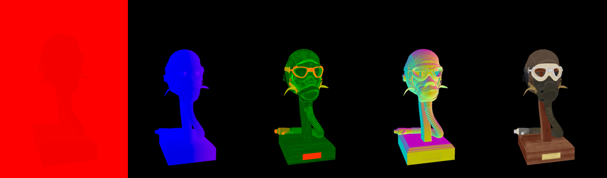

# Vulkan Renderer

## Project Overview
This project was part of my **"Graphics Programming 2"** course at **"Digital Arts and Entertainment"**.  
We made a 3D renderer using the Vulkan API.  

My project supports the following techniques or concepts:

- Images and Buffers, including texture loading  
- Depth Buffering  
- Interactive camera with frame-independent controls  
- Deferred Rendering with Depth Prepass  
- Physically Based Lighting using Image-Based Lighting with HDR images, Cook-Torrance BRDF materials (using textures), Point Light, and Directional Light  
- Post Processing chain with Tone Mapping  

---

# Showcase Renders

## Sponza Scene

## Flight Helmet Scene

## Deferred Rendering 
Depth Prepass → Position → MetalRough → Normal → Albedo  

